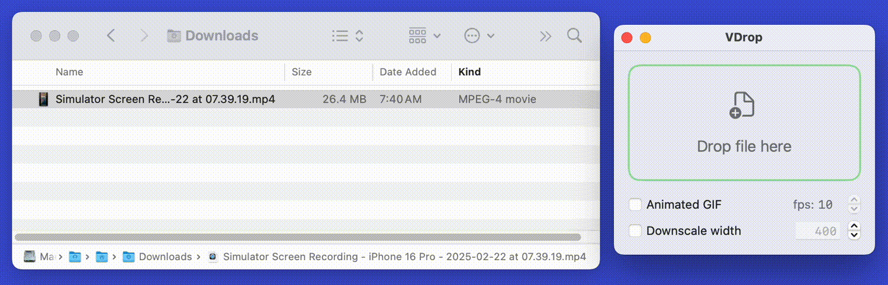

# VDrop
This is a little utility for macOS. It lets you drag and drop a video file which it then uses ffmpeg to convert to .mp4 and reduce the file size. You can also optionally scale the video size down to make it smaller.

I made this app because I frequently use ffmpeg to reduce the file size of videos I have created in the iOS simulator. I reduce the file size before sharing with others in Slack/Teams/Jira etc. I also sometimes downscale the video dimensions so that it doesn't appear gigantic in my PR descriptions.

This is a work-in-progress. It's pretty "bare-bones" right now.

Built with Xcode 16.2

Known TODOs:
- Assumes ffmpeg is installed on your system in `/opt/homebrew/bin/`. Won't work without it.
- Hard-coded list of presets for downscaling are all iPhone aspect ratios. Dynamically resizing by some percentage and keeping the aspect ratio correct would be nicer.
- ffmpeg could fail. There is currently no error messaging.

